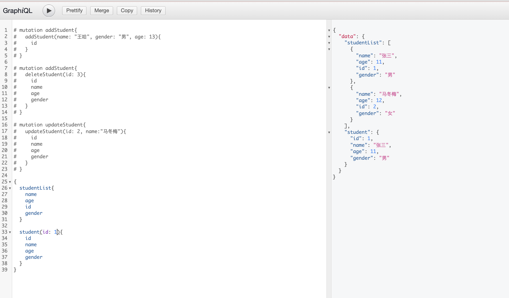

# Koa2, GraphQL, MySQL, TypeORM

## 引入*Koa2*

```
yarn add koa
```

在 _src/server.js_ 文件中加入以下代码，

```javascript
import Koa from "koa";
const app = new Koa();

app.use(async (ctx) => {
  ctx.body = "hello world!";
});

app.listen(3000);
```

运行文件后，在浏览器中打开 http://localhost:3000 ，可以看到输出 _hello world!_ 。

---

## 引入 _TypeORM_, _MySQL_

```
yarn add typeorm reflect-metadata mysql typescript
```

添加文件 _tsconfig.json_，实现对 _typescript_ 的支持，

```json
{
  "compilerOptions": {
    "target": "ES2017",
    "module": "commonjs",
    "lib": ["es6"],
    "sourceMap": true,
    "outDir": "dist",
    "noImplicitAny": true,
    "strictNullChecks": true,
    "moduleResolution": "node",
    "baseUrl": ".",
    "paths": {
      "*": ["node_modules/*"]
    },
    "allowSyntheticDefaultImports": true,
    "esModuleInterop": true,
    "experimentalDecorators": true,
    "emitDecoratorMetadata": true,
    "skipLibCheck": true,
    "forceConsistentCasingInFileNames": true
  },
  "include": ["src/**/*"]
}
```

添加 _ormconfig.js_ 文件，配置 _TypeORM_

```javascript
module.exports = {
  type: "mysql",
  host: "localhost",
  port: 3306,
  username: "root",
  password: process.env.DB_PASSWORD,
  database: "school",
  synchronize: true,
  entities: ["src/entity/*.ts"],
  cli: {
    entitiesDir: "src/entity",
  },
};
```

在 _src/entity/student.ts_ 中定义实体

```typescript
import { Entity, Column, PrimaryGeneratedColumn } from "typeorm";

@Entity()
export class Student {
  @PrimaryGeneratedColumn()
  id: number;

  @Column()
  name: string;

  @Column()
  age: number;

  @Column()
  gender: "男" | "女";
}
```

在 _src/Controllers/Student.ts_ 中加入以下代码，实现对表的操作

```typescript
import { Student } from "../entity/student";
import { getManager } from "typeorm";

export class StudentController {
  static async fetchAllStudents() {
    const studentRepository = getManager().getRepository(Student);
    const students = await studentRepository.find();
    return students;
  }

  static async fetchStudentById(id: number) {
    const studentRepository = getManager().getRepository(Student);
    const student = await studentRepository.findOne({
      id,
    });
    return student;
  }

  static async addStudent({ name, age, gender }: Omit<Student, "id">) {
    const studentRepository = getManager().getRepository(Student);
    const student = studentRepository.create({
      name,
      age,
      gender,
    });

    await studentRepository.save(student);
    return student;
  }

  static async deleteStudentById(id: number) {
    const studentRepository = getManager().getRepository(Student);
    const student = await StudentController.fetchStudentById(id);
    if (student) {
      await studentRepository.delete(student);
    }
    return student;
  }

  static async updateStudentById(id: number, name: string) {
    const studentRepository = getManager().getRepository(Student);
    await studentRepository.update({ id }, { name });
    const student = await StudentController.fetchStudentById(id);
    return student;
  }
}
```

更改 _src/server.ts_ 文件

```ts
import Koa from "koa";
import { createConnection } from "typeorm";
import "reflect-metadata";

createConnection().then(() => {
  const app = new Koa();

  app.use(async (ctx) => {
    const students = await StudentController.fetchAllStudents();
    ctx.body = students;
  });

  app.listen(3000);
});
```

现在在浏览器中可以看到返回的学生列表。

---

## 使用 _GraphQL_

```bash
yarn add koa-mount graphql koa-graphql
```

在 _src/schema/default.ts_ 中加入以下代码，

```ts
import {
  GraphQLObjectType,
  GraphQLString,
  GraphQLInt,
  GraphQLList,
  GraphQLSchema,
} from "graphql";
import { StudentController } from "../Controllers/Student";

const StudentSchema = new GraphQLObjectType({
  name: "student",
  fields: {
    id: {
      type: GraphQLInt,
    },
    name: {
      type: GraphQLString,
    },
    age: {
      type: GraphQLInt,
    },
    gender: {
      type: GraphQLString,
    },
  },
});

const RootSchema = new GraphQLObjectType({
  name: "root",
  fields: {
    studentList: {
      type: new GraphQLList(StudentSchema),
      async resolve(parent, args) {
        const studentList = await StudentController.fetchAllStudents();
        return studentList;
      },
    },
    student: {
      type: StudentSchema,
      args: {
        id: {
          type: GraphQLInt,
        },
      },
      async resolve(parent, args) {
        console.log(args);
        const student = await StudentController.fetchStudentById(args.id);
        return student;
      },
    },
  },
});

const MutationSchema = new GraphQLObjectType({
  name: "mutation",
  fields: {
    addStudent: {
      type: StudentSchema,
      args: {
        name: {
          type: GraphQLString,
        },
        gender: {
          type: GraphQLString,
        },
        age: {
          type: GraphQLInt,
        },
      },
      async resolve(parent, args) {
        const student = await StudentController.addStudent({
          name: args.name,
          age: args.age,
          gender: args.gender,
        });
        return student;
      },
    },
    deleteStudent: {
      type: StudentSchema,
      args: {
        id: {
          type: GraphQLInt,
        },
      },
      async resolve(parent, args) {
        const deleteStudent = await StudentController.deleteStudentById(
          args.id
        );
        return deleteStudent;
      },
    },
    updateStudent: {
      type: StudentSchema,
      args: {
        id: {
          type: GraphQLInt,
        },
        name: {
          type: GraphQLString,
        },
      },
      async resolve(parent, args) {
        const student = await StudentController.updateStudentById(
          args.id,
          args.name
        );
        return student;
      },
    },
  },
});

export default new GraphQLSchema({
  query: RootSchema,
  mutation: MutationSchema,
});
```

更改 _src/server.ts_ 文件，

```ts
import Koa from "koa";
import { createConnection } from "typeorm";
import { graphqlHTTP } from "koa-graphql";
import mount from "koa-mount";
import "reflect-metadata";
import GraphQLDefaultSchema from "./schemas/default";

createConnection().then(() => {
  const app = new Koa();

  app.use(
    mount(
      "/graphql",
      graphqlHTTP({
        schema: GraphQLDefaultSchema,
        graphiql: true,
      })
    )
  );

  app.listen(process.env.PORT);
});
```

此时，打开浏览器，在 http://localhost:3000/graphql 中可以开始调试。



---

## 在 _React_ 中调用

```ts
fetch("/graphql?", {
  method: "POST",
  headers: {
    "Content-Type": "application/json",
  },
  body: JSON.stringify({
    query: `{
          studentList{
            id
            name
            age
            gender
          }
        }`,
  }),
});
fetch("/graphql?", {
  method: "POST",
  headers: {
    "Content-Type": "application/json",
  },
  body: JSON.stringify({
    query: `{
          student(id: 1){
            id
            name
            age
            gender
          }
        }`,
  }),
});
fetch("/graphql?", {
  method: "POST",
  headers: {
    "Content-Type": "application/json",
  },
  body: JSON.stringify({
    query: `mutation add{
          addStudent(name: "哈喽", gender: "男",age: 12){
            id
            name
            age
            gender
          }
        }`,
  }),
});
```
